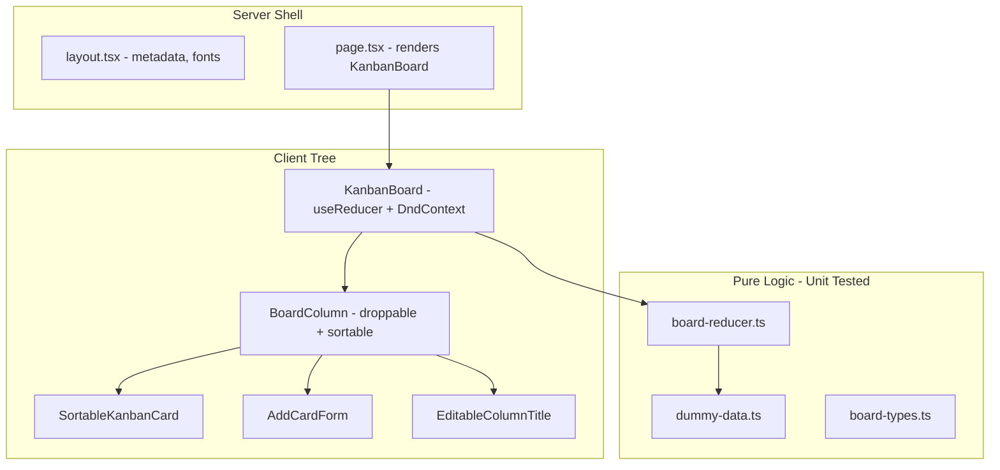

# Kanban MVP Implementation Plan

## Overview

Scaffold a client-rendered Next.js Kanban app in `frontend/`, implement a single-board MVP with drag-and-drop and dummy data, apply the specified color scheme, and validate with Vitest unit tests plus Playwright E2E tests.

## Implementation Todos

- [ ] Scaffold Next.js app in frontend/, add .gitignore, install dnd-kit + Vitest + Playwright
- [ ] Create board types, dummy data (5 columns), and pure board-reducer
- [ ] Build Kanban UI components with brand color scheme and dummy data render
- [ ] Wire add/delete cards, inline column rename, and @dnd-kit drag-and-drop
- [ ] Write Vitest tests for reducer, CRUD, and column rename
- [ ] Write Playwright E2E tests including cross-column drag
- [ ] Run full test suite, lint, dev server; confirm all AGENTS.md criteria met

## Current State

The repo contains only [AGENTS.md](AGENTS.md) and [README.md](README.md). All application code will be created from scratch under a new `frontend/` subdirectory.

## Architecture Overview



## Tech Stack

| Layer | Choice | Rationale |
|-------|--------|-----------|
| Framework | Next.js 16 (App Router) in `frontend/` | Matches AGENTS.md; latest idiomatic setup |
| Styling | Tailwind CSS + CSS variables for brand colors | Fast, professional UI with exact palette |
| Drag-and-drop | `@dnd-kit/core`, `@dnd-kit/sortable`, `@dnd-kit/utilities` | Active, accessible, official multi-container Kanban pattern |
| State | `useReducer` + pure reducer in `lib/` | Simple, testable, no persistence needed |
| Unit tests | Vitest + React Testing Library + user-event | Fast, official Next.js pattern |
| E2E tests | Playwright | Reliable for real pointer drag-and-drop |

**Scaffold command** (from repo root):

```bash
npx create-next-app@latest frontend --typescript --tailwind --eslint --app --src-dir --import-alias "@/*"
```

---

## Phase 1: Project Scaffolding

**Goal:** Runnable Next.js app with testing infrastructure and repo hygiene.

**Tasks:**
- Run `create-next-app` into [frontend/](frontend/)
- Add root [.gitignore](.gitignore) covering `node_modules/`, `.next/`, `dist/`, `.env*`, Playwright artifacts (`test-results/`, `playwright-report/`)
- Install runtime deps: `@dnd-kit/core`, `@dnd-kit/sortable`, `@dnd-kit/utilities`
- Install dev deps: `vitest`, `@vitejs/plugin-react`, `jsdom`, `@testing-library/react`, `@testing-library/dom`, `@testing-library/user-event`, `@testing-library/jest-dom`, `vite-tsconfig-paths`, `@playwright/test`
- Add config files:
  - [frontend/vitest.config.mts](frontend/vitest.config.mts) — `jsdom`, path aliases, exclude `e2e/**`
  - [frontend/vitest.setup.ts](frontend/vitest.setup.ts) — jest-dom matchers, RTL cleanup
  - [frontend/playwright.config.ts](frontend/playwright.config.ts) — `webServer` runs `npm run dev`
- Add npm scripts: `test`, `test:run`, `test:e2e`
- Keep [README.md](README.md) minimal (how to install, dev, test, run)

**Success criteria:**
- [ ] `cd frontend && npm run dev` starts without errors
- [ ] `npm run test:run` executes (even if zero tests initially)
- [ ] `npx playwright install` completes; `npm run test:e2e` can launch dev server
- [ ] `.gitignore` excludes build artifacts and dependencies

---

## Phase 2: Data Model and Dummy Data

**Goal:** Typed board state with seeded content for the single board.

**Files:**
- [frontend/src/lib/board-types.ts](frontend/src/lib/board-types.ts)
- [frontend/src/lib/dummy-data.ts](frontend/src/lib/dummy-data.ts)
- [frontend/src/lib/board-reducer.ts](frontend/src/lib/board-reducer.ts)

**Data shape:**

```ts
type Column = { id: string; title: string }
type Card = { id: string; columnId: string; title: string; details: string }
type BoardState = { columns: Column[]; cards: Card[] }
```

**Reducer actions** (keep minimal):
- `RENAME_COLUMN` — update column title
- `ADD_CARD` — append card to a column
- `DELETE_CARD` — remove by id
- `MOVE_CARD` — change `columnId` and position (used by DnD)

**Dummy data:** Exactly 5 columns with distinct default titles (e.g. Backlog, To Do, In Progress, Review, Done) and 8–12 sample cards spread across columns with realistic titles/details.

**Success criteria:**
- [ ] Board always initializes with exactly 5 columns
- [ ] Dummy cards render on first load without user action
- [ ] Reducer functions are pure and independently testable

---

## Phase 3: UI Foundation and Color Scheme

**Goal:** Professional, polished visual shell before wiring interactivity.

**Brand tokens** in [frontend/src/app/globals.css](frontend/src/app/globals.css):

| Token | Hex | Usage |
|-------|-----|-------|
| `--accent-yellow` | `#ecad0a` | Accent lines, highlights |
| `--blue-primary` | `#209dd7` | Links, key sections |
| `--purple-secondary` | `#753991` | Submit / primary action buttons |
| `--dark-navy` | `#032147` | Main headings |
| `--gray-text` | `#888888` | Labels, supporting text |

**Layout:**
- [frontend/src/app/layout.tsx](frontend/src/app/layout.tsx) — server component: metadata, font, global styles
- [frontend/src/app/page.tsx](frontend/src/app/page.tsx) — thin entry rendering `<KanbanBoard />`
- [frontend/src/components/board/KanbanBoard.tsx](frontend/src/components/board/KanbanBoard.tsx) — `'use client'`, holds reducer state, renders 5 columns in a horizontal scroll/flex layout
- [frontend/src/components/board/BoardColumn.tsx](frontend/src/components/board/BoardColumn.tsx) — column header + card list area
- [frontend/src/components/board/KanbanCard.tsx](frontend/src/components/board/KanbanCard.tsx) — title + details display, delete button
- [frontend/src/components/board/EditableColumnTitle.tsx](frontend/src/components/board/EditableColumnTitle.tsx) — inline rename (click to edit, blur/Enter to save)
- [frontend/src/components/board/AddCardForm.tsx](frontend/src/components/board/AddCardForm.tsx) — title + details inputs, purple submit button

**UX polish targets:**
- Subtle shadows, rounded corners, hover states on cards
- Yellow accent on column top border or active focus ring
- Navy page heading; gray labels on form fields
- Responsive horizontal board with consistent column width

**Success criteria:**
- [ ] All five brand colors appear in the live UI
- [ ] Board renders 5 columns and dummy cards with elegant spacing/typography
- [ ] Column titles are editable inline
- [ ] Add-card form and delete button work (before DnD)

---

## Phase 4: Drag and Drop

**Goal:** Move cards within and between columns with smooth interaction.

**Files:**
- [frontend/src/components/board/SortableKanbanCard.tsx](frontend/src/components/board/SortableKanbanCard.tsx) — `useSortable` wrapper around `KanbanCard`
- Update `KanbanBoard.tsx` and `BoardColumn.tsx` for `DndContext`, `useDroppable`, `SortableContext`

**Implementation pattern** (per @dnd-kit multi-container guide):
- `DndContext` at board level with `PointerSensor` + `KeyboardSensor`
- Each column: `useDroppable` + `SortableContext` with card ids
- `onDragOver` — live cross-column preview
- `onDragEnd` — dispatch `MOVE_CARD` to reducer with final column + index
- Drag overlay for visual feedback during drag

**Success criteria:**
- [ ] Cards drag within a column (reorder)
- [ ] Cards drag across columns
- [ ] Card count per column updates correctly after drop
- [ ] No persistence — refresh resets to dummy data (expected)

---

## Phase 5: Unit Tests (Rigorous)

**Goal:** High-confidence coverage of business logic and key UI flows.

**Test files:**
- [frontend/src/lib/board-reducer.test.ts](frontend/src/lib/board-reducer.test.ts) — all reducer actions, edge cases (delete missing card, move to same position, rename)
- [frontend/src/components/board/KanbanBoard.test.tsx](frontend/src/components/board/KanbanBoard.test.tsx) — renders dummy data, add card, delete card, rename column
- [frontend/src/components/board/AddCardForm.test.tsx](frontend/src/components/board/AddCardForm.test.tsx) — validation/submit behavior

**Do not unit-test drag-and-drop** in jsdom — defer to Playwright.

**Success criteria:**
- [ ] `npm run test:run` passes with meaningful coverage of reducer + CRUD + rename
- [ ] Tests are deterministic and do not depend on browser drag APIs

---

## Phase 6: E2E Tests (Playwright)

**Goal:** Validate full user workflows including drag-and-drop.

**File:** [frontend/e2e/kanban.spec.ts](frontend/e2e/kanban.spec.ts)

**Scenarios:**
1. App loads with dummy data (5 columns, multiple cards)
2. Add a new card to a column; verify it appears
3. Delete a card; verify it disappears
4. Rename a column; verify new title persists in session
5. Drag a card from one column to another; verify it moved

**Success criteria:**
- [ ] `npm run test:e2e` passes all scenarios against `npm run dev`
- [ ] Any failures are fixed before declaring MVP complete

---

## Phase 7: Final Verification and Handoff

**Goal:** MVP complete per AGENTS.md — running server, tested, no scope creep.

**Checklist against business requirements:**

| Requirement | Verified by |
|-------------|-------------|
| Single board only | UI has no board switcher |
| 5 fixed renameable columns | Initial state + rename E2E |
| Card title + details only | Component shape + tests |
| Drag-and-drop between columns | Playwright drag test |
| Add / delete cards | Unit + E2E tests |
| No archive, search, filter | Code review — not implemented |
| Dummy data on open | Load test + E2E |
| Slick professional UI | Visual pass with brand colors |
| Client-rendered Next.js in `frontend/` | `'use client'` board boundary |
| No persistence / no users | Refresh resets state |

**Final deliverables:**
- Dev server running at `http://localhost:3000`
- All unit and E2E tests green
- Minimal README with setup/run/test instructions (no emojis)

---

## Out of Scope (Explicitly Excluded)

- Database, localStorage, or API persistence
- Authentication / user management
- Multiple boards, archiving, search, filters
- Server Actions, API routes, or SSR data fetching
- Over-engineered state libraries (Redux, Zustand)

## Risk Notes

- **DnD in Playwright:** Use `locator.dragTo()` with stable `data-testid` attributes on cards/columns if default selectors are flaky.
- **React 19 + testing:** Use `@testing-library/react` v16+ compatible with React 19.
- **Next.js 16 lint:** ESLint is separate from build; run `npm run lint` as part of final verification.
